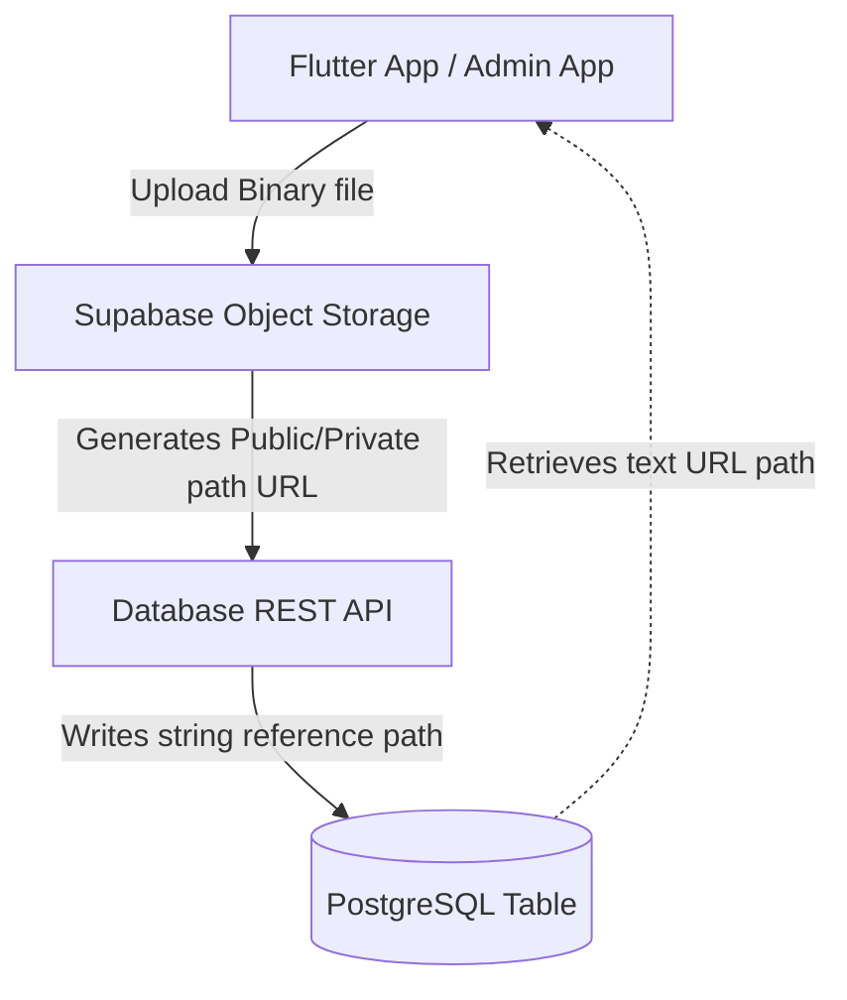

# 4.3 Detailed Design

The Detailed Design phase translates the high-level architecture of RehabAI into concrete software components and database tables. The system operates on a hybrid architecture combining client-side real-time processing (Edge AI) with a robust REST API backend.

## Architectural Flow & Logic
RehabAI's core function is to guide, monitor, and assess patient rehabilitation. To do this efficiently, the workload is distributed as follows:
1. **Real-time Pose Analysis (Edge AI)**: Executed directly on the user's mobile device. The Flutter client utilizes Google ML Kit Pose Detection to extract 3D body coordinates at 30 frames per second. These coordinates are passed into client-side analytical classes (`PostureAnalyzer` and `MovementAnalyzer`) which run geometric heuristics to calculate joint angles and track repetition phases. This edge approach guarantees zero network latency, ensuring immediate audio-visual feedback.
2. **Database & Realtime Channel Synchronization**: Client performance records, equipment rentals, and text chat transcripts are updated in the Supabase PostgreSQL database. Realtime changes are synchronized across devices (e.g., notifying the physiotherapist of a new chat or patient registration) using PostgreSQL Write-Ahead Logging (WAL) replicated via WebSockets.
3. **Asynchronous REST API Backend**: The FastAPI backend acts as an entry point for administrative operations (managing inventory, uploading evidence photos), authentication bridges, and AI-assisted triage routing using the Gemini API.

---

## 4.3.1 Software Design

This section details the Object-Oriented Analysis and Design (OOAD) structure. Because the application frontend is implemented in Dart (Flutter) and the backend in Python, the software design is described using class specifications, attributes, and methods mapping directly to their respective environments.

### 1. `PostureAnalyzer` (Dart Class)
* **File Location**: `lib/services/posture_analyzer.dart`
* **Responsibility**: Evaluates individual video frames by matching extracted landmark keypoints against pre-defined geometric boundaries (defined in `posture_rules.json`). It calculates anatomical joint angles (e.g., knee extension, elbow angle, body alignment) and determines if the user is holding the correct posture.

#### Attributes:
* `rule` (Type: `PostureRule?`): The specific exercise posture rule loaded from configuration containing acceptable min/max angle limits.
* `requestedExerciseId` (Type: `int?`): The database identifier of the exercise being monitored.
* `requestedExerciseName` (Type: `String`): The fallback name of the exercise used to match rules.
* `_consecutiveCorrectFrames` (Type: `int`): Tracks how many sequential video frames have satisfied the posture constraints (to ensure stability).
* `_activeArmSide` (Type: `_BodySide?`): Tracks whether the left or right arm is currently active.
* `_minimumLikelihood` (Type: `double`, Constant: `0.5`): The minimum confidence score required from ML Kit before a landmark is evaluated.

#### Methods & Algorithms:

##### A. `create` (Factory Method)
* **Responsibility**: Asynchronously loads all posture rules from the local JSON asset file, locates the rule corresponding to the target exercise, and instantiates the analyzer.
* **Input Parameters**: 
  * `exerciseId` (`int?`) - Unique ID of the exercise.
  * `exerciseName` (`String`) - Alternative text identifier for mapping rules.
* **Output Parameter**: `Future<PostureAnalyzer>`
* **Pre-condition**: None.
* **Post-condition**: An initialized `PostureAnalyzer` with either a matched rule or a null reference if no rule exists.
* **Algorithm**:
```dart
static Future<PostureAnalyzer> create({required int? exerciseId, String exerciseName = ''}) async {
    // 1. If global static rules map is null, read 'assets/exercise_sources/posture_rules.json'
    // 2. Decode JSON string into Map<int, PostureRule>
    // 3. Search for rule matching exerciseId; if not found, search via exerciseName aliases
    // 4. Return new PostureAnalyzer instance with the matched PostureRule
}
```

##### B. `analyzePose`
* **Responsibility**: Processes a single frame's pose coordinates, evaluates all rule checks, and returns a formatted result containing an accuracy score and real-time guidance feedback.
* **Input Parameter**: `pose` (`Pose` from ML Kit)
* **Output Parameter**: `PostureResult` (contains `accuracy` (double), `feedback` (String), `correctPose` (bool))
* **Pre-condition**: Analyzer must have a valid `rule` loaded.
* **Post-condition**: Consecutive frame counter updated.
* **Algorithm**:
```dart
PostureResult analyzePose(Pose pose) {
    if (this.rule == null) {
        return new PostureResult(0.0, "No posture rule found", false);
    }
    if (pose.landmarks.isEmpty) {
        this.reset();
        return new PostureResult(0.0, "No person detected.", false);
    }
    
    // Evaluate each PostureCheck in the rule list
    List<CheckEvaluation> evaluations = [];
    for (PostureCheck check in this.rule.checks) {
        evaluations.add(this._evaluateCheck(pose, check));
    }
    
    // Check if any required landmark is missing or low-likelihood
    var missing = evaluations.where((e) => e.value == null);
    if (missing.isNotEmpty) {
        this._consecutiveCorrectFrames = 0;
        return new PostureResult(0.0, "Keep " + missing.first.check.label + " visible in the frame.", false);
    }
    
    // Calculate average accuracy score (0.0 to 100.0)
    double accuracy = evaluations.map((e) => e.score).reduce((a, b) => a + b) / evaluations.length;
    
    // Find failed checks
    var failed = evaluations.where((e) => !e.passed).toList();
    if (failed.isNotEmpty) {
        this._consecutiveCorrectFrames = 0;
        // Sort to address the worst infraction first
        failed.sort((a, b) => a.score.compareTo(b.score));
        return new PostureResult(accuracy, this._failureFeedback(failed.first), false);
    }
    
    // Increment consecutive correct frames to verify stability
    this._consecutiveCorrectFrames++;
    bool stable = this._consecutiveCorrectFrames >= this.rule.stableFrames;
    
    if (stable) {
        return new PostureResult(accuracy, "Correct posture. Keep holding.", true);
    } else {
        return new PostureResult(accuracy, "Good position. Hold steady (" + this._consecutiveCorrectFrames + "/" + this.rule.stableFrames + ").", false);
    }
}
```

##### C. `_evaluateCheck`
* **Responsibility**: Checks if a single anatomical metric falls within the specified min/max thresholds.
* **Input Parameters**: `pose` (`Pose`), `check` (`PostureCheck`)
* **Output Parameter**: `_CheckEvaluation` (contains `check`, `value`, `score`, `passed`)
* **Pre-condition**: None.
* **Post-condition**: None.
* **Algorithm**:
```dart
_CheckEvaluation _evaluateCheck(Pose pose, PostureCheck check) {
    double? value = this._metricValue(pose, check);
    if (value == null) {
        return new _CheckEvaluation(check, null, 0.0, false);
    }
    bool passed = (value >= check.minimum && value <= check.maximum);
    double error = 0.0;
    if (value < check.minimum) {
        error = check.minimum - value;
    } else if (value > check.maximum) {
        error = value - check.maximum;
    }
    double tolerance = max(10.0, check.maximum - check.minimum);
    double score = clamp(100.0 - (error / tolerance * 100.0), 0.0, 100.0);
    return new _CheckEvaluation(check, value, score, passed);
}
```

##### D. `_kneeAngle` (Trigonometric Helper)
* **Responsibility**: Calculates the interior 2D angle (in degrees) formed at the knee joint by the hip, knee, and ankle landmarks.
* **Input Parameters**: `pose` (`Pose`), `side` (`_BodySide` - left or right)
* **Output Parameter**: `double?` (Angle in degrees or null if points are missing)
* **Pre-condition**: Landmarks must have confidence/likelihood >= 0.5.
* **Post-condition**: None.
* **Algorithm**:
```dart
double? _kneeAngle(Pose pose, _BodySide side) {
    PoseLandmark? hip = this._landmark(pose, side == left ? leftHip : rightHip);
    PoseLandmark? knee = this._landmark(pose, side == left ? leftKnee : rightKnee);
    PoseLandmark? ankle = this._landmark(pose, side == left ? leftAnkle : rightAnkle);
    
    if (hip == null || knee == null || ankle == null) return null;
    
    // Calculate vectors hip->knee and ankle->knee
    double v1x = hip.x - knee.x;
    double v1y = hip.y - knee.y;
    double v2x = ankle.x - knee.x;
    double v2y = ankle.y - knee.y;
    
    // Apply dot product formula to find the angle between vectors
    double dotProduct = v1x * v2x + v1y * v2y;
    double magnitude1 = sqrt(v1x * v1x + v1y * v1y);
    double magnitude2 = sqrt(v2x * v2x + v2y * v2y);
    
    if (magnitude1 == 0 || magnitude2 == 0) return 0.0;
    double cosine = clamp(dotProduct / (magnitude1 * magnitude2), -1.0, 1.0);
    return acos(cosine) * 180.0 / pi;
}
```

---

### 2. `MovementAnalyzer` (Dart Class)
* **File Location**: `lib/services/movement_analyzer.dart`
* **Responsibility**: Analyzes consecutive video frames during dynamic, repetitive exercises (e.g., Bicep Curl, Squats, Heel Raises) using a state-machine pattern. It identifies transitions between `start` and `end` positions to register completed exercise repetitions.

#### Attributes:
* `rule` (Type: `RepRule?`): The mapping constraints loaded from `rep_count_rules.json` (such as thresholds and stable frames).
* `_currentState` (Type: `MovementState`): The active validated state of the movement (`unknown`, `start`, or `end`).
* `_candidateState` (Type: `MovementState`): The state currently being proposed based on recent frame values.
* `_candidateFrames` (Type: `int`): Count of sequential frames that have matched the candidate state (filters jitter).
* `_cooldownRemaining` (Type: `int`): Frame cooldown counter to prevent double-counting a single repetition.
* `_baselineValue` (Type: `double?`): Reference coordinate point captured at the beginning of dynamic exercises (used for height/depth delta measurements).
* `lastFeedback` (Type: `String`): The feedback instruction string describing current posture accuracy.

#### Methods & Algorithms:

##### A. `analyzeForRep`
* **Responsibility**: Receives the current frame's landmarks, calculates the diagnostic feature value, updates the movement state machine, and returns true only if a repetition has been completed (a transition from `start` -> `end` -> `start` is verified).
* **Input Parameter**: `pose` (`Pose`)
* **Output Parameter**: `bool` (True if a rep is completed)
* **Pre-condition**: Analyzer must have a valid `rule` loaded.
* **Post-condition**: Cooldowns and states updated.
* **Algorithm**:
```dart
bool analyzeForRep(Pose pose) {
    if (this.rule == null) return false;
    
    if (this._cooldownRemaining > 0) {
        this._cooldownRemaining--;
    }
    
    // 1. Calculate numerical feature representation of active pose (e.g. elbow extension ratio)
    double? feature = this._calculateFeature(pose, this.rule.detector);
    if (feature == null) {
        this._candidateState = unknown;
        this._candidateFrames = 0;
        this.lastFeedback = "Keep required body parts visible.";
        return false;
    }
    
    // 2. Classify raw feature into start or end states using thresholds
    MovementState phase = this._classify(feature, this.rule);
    if (phase == unknown) {
        this._candidateState = unknown;
        this._candidateFrames = 0;
        this.lastFeedback = (this._currentState == start) 
            ? "Continue to the end position." 
            : "Return fully to the start position.";
        return false;
    }
    
    // 3. Increment candidate frames if state is consistent
    if (this._candidateState != phase) {
        this._candidateState = phase;
        this._candidateFrames = 1;
    } else {
        this._candidateFrames++;
    }
    
    // 4. Verify candidate stability (requires stable_frames consecutive hits)
    if (this._candidateFrames < this.rule.stableFrames) {
        return false;
    }
    
    // 5. Execute state machine logic
    if (phase == start) {
        if (this._currentState == end && this._cooldownRemaining == 0) {
            this._currentState = start;
            this._cooldownRemaining = this.rule.cooldownFrames;
            this.lastFeedback = "Rep completed! Move to end position.";
            return true; // REPETITION COMPLETED
        }
        this._currentState = start;
        this.lastFeedback = "Start position detected. Perform movement.";
    } else if (this._currentState == start) {
        this._currentState = end;
        this.lastFeedback = "End position detected. Return to start.";
    }
    return false;
}
```

##### B. `_clamshellFeature`
* **Responsibility**: Computes the ratio of distance between knees relative to torso length. Normalizing by torso height ensures distance calculations are invariant to how far the user stands from the camera.
* **Input Parameter**: `pose` (`Pose`)
* **Output Parameter**: `double?` (Normalized ratio)
* **Pre-condition**: None.
* **Post-condition**: None.
* **Algorithm**:
```dart
double? _clamshellFeature(Pose pose) {
    PosePoint? leftKnee = this._point(pose, leftKneeLandmark);
    PosePoint? rightKnee = this._point(pose, rightKneeLandmark);
    double? torso = this._torsoLength(pose); // distance between mid-shoulder and mid-hip
    
    if (leftKnee == null || rightKnee == null || torso == null || torso == 0) {
        return null;
    }
    
    double dx = leftKnee.x - rightKnee.x;
    double dy = leftKnee.y - rightKnee.y;
    double kneeDistance = sqrt(dx * dx + dy * dy);
    
    return kneeDistance / torso;
}
```

---

### 3. `VoiceCoach` (Dart Class)
* **File Location**: `lib/services/voice_coach.dart`
* **Responsibility**: Provides spoken accessibility feedback using text-to-speech. It prevents repetitive audio spam by checking temporal limits and removing raw numeric changes from vocal feedback.

#### Attributes:
* `_tts` (Type: `FlutterTts`): Native platform interface for text-to-speech rendering.
* `_lastKey` (Type: `String?`): The lowercase string value of the last feedback spoken.
* `_lastSpokenAt` (Type: `DateTime?`): Timestamp of the last successful audio output.
* `_disposed` (Type: `bool`): Indicates if the instance has been released from memory.

#### Methods & Algorithms:

##### A. `speak`
* **Responsibility**: Queues feedback messages to the text-to-speech engine if the cooldown period has elapsed.
* **Input Parameters**: 
  * `feedback` (`String`) - The text instruction to speak.
  * `force` (`bool`, default: `false`) - Bypass timing checks and immediately interrupt previous audio.
  * `minimumGap` (`Duration`, default: `2500ms`) - Minimum delay between distinct statements.
  * `repeatAfter` (`Duration`, default: `7s`) - Minimum delay before repeating identical instructions.
* **Output Parameter**: `Future<void>`
* **Pre-condition**: `VoiceCoach` is not disposed.
* **Post-condition**: Cooldown timer reset if spoken.
* **Algorithm**:
```dart
Future<void> speak(String feedback, {bool force = false, Duration minimumGap = 2500ms, Duration repeatAfter = 7s}) async {
    if (this._disposed) return;
    
    String message = this._speechFriendly(feedback);
    if (message.isEmpty) return;
    
    DateTime now = DateTime.now();
    if (!force && this._lastSpokenAt != null) {
        Duration elapsed = now.difference(this._lastSpokenAt!);
        String key = message.toLowerCase();
        
        // Block spoken feedback if too frequent or repeating identical commands
        if (elapsed < minimumGap || (key == this._lastKey && elapsed < repeatAfter)) {
            return;
        }
    }
    
    this._lastKey = message.toLowerCase();
    this._lastSpokenAt = now;
    
    if (force) {
        await this._tts.stop();
    }
    await this._tts.speak(message);
}
```

##### B. `_speechFriendly`
* **Responsibility**: Scrubs numeric details (like shifting angle percentages) that change frame-by-frame, replacing them with generic commands to sound natural.
* **Input Parameter**: `feedback` (`String`)
* **Output Parameter**: `String` (Text optimized for voice output)
* **Algorithm**:
```dart
String _speechFriendly(String feedback) {
    String message = feedback.trim();
    // E.g., convert "Reduce knee angle: 125° (target 90-110°)" to "Reduce knee angle."
    if (message.startsWith("Increase ") || message.startsWith("Reduce ")) {
        int separator = message.indexOf(":");
        if (separator > 0) {
            message = message.substring(0, separator) + ".";
        }
    }
    if (message.startsWith("Good position. Hold steady")) {
        message = "Good position. Hold steady.";
    }
    return message;
}
```

---

### 4. `LiveChatSession` (Python Backend Controller & Model Logic)
* **File Location**: `backend/models.py` (representing the underlying entity)
* **Responsibility**: Manages the clinical triage questionnaire and communication routing between a student patient and assigned physiotherapist.

#### Attributes (from database model mapping):
* `session_id` (Type: `int`): Primary Key.
* `therapist_id` (Type: `int?`): Foreign key to the physiotherapist; null during initial AI triage.
* `student_id` (Type: `int`): Foreign key matching the patient profile.
* `session_status` (Type: `String`): State marker constraints (`Triage`, `Active`, `Emergency`, `Closed`).
* `triage_data` (Type: `JSON`): Structured pain location, severity, and onset duration inputs collected by the chatbot.
* `teleconference_room` (Type: `String?`): Unique Jitsi Meet identifier generated dynamically when escalations require video assessment.

#### Key Operations:

##### A. `initialize_session` (Endpoint Logic)
* **Responsibility**: Instantiates a new triage chat log, saving structural questionnaire outputs.
* **Input Parameters**: `student_id` (`int`), `subject` (`String`), `triage_data` (`dict`)
* **Output Parameter**: `LiveChatSession` entity
* **Pre-condition**: User must have the role `'S'` (Student).
* **Post-condition**: Record added in state `'Triage'`.
* **Algorithm**:
```python
def initialize_session(db_session, student_id, subject, triage_data):
    # 1. Verify student exists and has 'S' role
    # 2. Check for active unclosed sessions to prevent duplicates
    # 3. Create LiveChatSession with status='Triage', saving triage_data json
    # 4. Insert system introductory welcome message in ChatLog
    # 5. Commit database record and return session object
```

##### B. `escalate_to_teleconference` (Endpoint Logic)
* **Responsibility**: Generates a secure random meeting room key, moves status to Active, and alerts the therapist.
* **Input Parameters**: `session_id` (`int`), `therapist_id` (`int`)
* **Output Parameter**: `LiveChatSession` entity (containing updated teleconference URL details)
* **Pre-condition**: Target session status must be `'Active'`.
* **Post-condition**: Meeting room is active and broadcasted via Supabase Realtime websocket channel.

---

## 4.3.2 Physical Database Design

The logical entity relationships are translated into physical database structures optimized for **Supabase PostgreSQL**. This design enforces data integrity, index efficiency, and secure transactional states.

### 1. Database Definition Language (DDL) Schema

Below are the base tables, constraints, and data validation rules written in ANSI SQL syntax compatible with PostgreSQL:

```sql
-- Disable triggers and cascade drop tables during schema rebuilds (if necessary)
DROP TABLE IF EXISTS "Session_Log" CASCADE;
DROP TABLE IF EXISTS "Chat_Log" CASCADE;
DROP TABLE IF EXISTS "Chat_Read_Receipt" CASCADE;
DROP TABLE IF EXISTS "Live_Chat_Session" CASCADE;
DROP TABLE IF EXISTS "Prescribed_Exercise" CASCADE;
DROP TABLE IF EXISTS "Appointment" CASCADE;
DROP TABLE IF EXISTS "Rental_Record" CASCADE;
DROP TABLE IF EXISTS "Equipment_Category" CASCADE;
DROP TABLE IF EXISTS "Equipment" CASCADE;
DROP TABLE IF EXISTS "Admin" CASCADE;
DROP TABLE IF EXISTS "Physiotherapist" CASCADE;
DROP TABLE IF EXISTS "Student" CASCADE;
DROP TABLE IF EXISTS "User" CASCADE;
DROP TABLE IF EXISTS "Category" CASCADE;
DROP TABLE IF EXISTS "Rental_Reason" CASCADE;
DROP TABLE IF EXISTS "Cancellation_Reason" CASCADE;
DROP TABLE IF EXISTS "Discipline" CASCADE;
DROP TABLE IF EXISTS "Exercise" CASCADE;
DROP TABLE IF EXISTS "Exercise_Discipline" CASCADE;

-- 1. Master User Table (Core Account Profiles)
CREATE TABLE "User" (
    user_id SERIAL PRIMARY KEY,
    supabase_id VARCHAR(36) UNIQUE NULL,
    username VARCHAR(50) NOT NULL,
    identity_number VARCHAR(20) NOT NULL,
    email VARCHAR(100) NOT NULL,
    gender VARCHAR(10) NOT NULL,
    contact_number VARCHAR(20) NOT NULL,
    address TEXT NULL,
    accommodation_type VARCHAR(50) NULL,
    fcm_token VARCHAR(255) NULL,
    role VARCHAR(1) NOT NULL DEFAULT 'S',
    CONSTRAINT check_valid_role CHECK (role IN ('S', 'P', 'A'))
);

-- 2. Student Sub-type Profile
CREATE TABLE "Student" (
    student_id INT PRIMARY KEY,
    matric_no VARCHAR(15) NULL,
    profile_picture VARCHAR(255) NULL,
    FOREIGN KEY (student_id) REFERENCES "User"(user_id) ON DELETE CASCADE
);

-- 3. Physiotherapist Sub-type Profile
CREATE TABLE "Physiotherapist" (
    therapist_id INT PRIMARY KEY,
    specialization VARCHAR(30) NOT NULL,
    leave_start_date TIMESTAMP WITH TIME ZONE NULL,
    leave_end_date TIMESTAMP WITH TIME ZONE NULL,
    FOREIGN KEY (therapist_id) REFERENCES "User"(user_id) ON DELETE CASCADE
);

-- 4. Administrator Sub-type Profile
CREATE TABLE "Admin" (
    admin_id INT PRIMARY KEY,
    shift VARCHAR(50) NULL,
    off_day VARCHAR(20) NULL,
    FOREIGN KEY (admin_id) REFERENCES "User"(user_id) ON DELETE CASCADE
);

-- 5. Equipment Inventory Table
CREATE TABLE "Equipment" (
    equipment_id SERIAL PRIMARY KEY,
    admin_id INT NULL,
    name VARCHAR(50) NOT NULL,
    description TEXT NULL,
    stock INT NOT NULL DEFAULT 0,
    image VARCHAR(255) NULL,
    FOREIGN KEY (admin_id) REFERENCES "Admin"(admin_id) ON DELETE SET NULL,
    CONSTRAINT check_stock_non_negative CHECK (stock >= 0)
);

-- 6. Equipment Categories Lookup Table
CREATE TABLE "Category" (
    category_id SERIAL PRIMARY KEY,
    description VARCHAR(30) NOT NULL
);

-- 7. Bridge Table for Equipment - Category Relationships
CREATE TABLE "Equipment_Category" (
    equipment_id INT NOT NULL,
    category_id INT NOT NULL,
    PRIMARY KEY (equipment_id, category_id),
    FOREIGN KEY (equipment_id) REFERENCES "Equipment"(equipment_id) ON DELETE CASCADE,
    FOREIGN KEY (category_id) REFERENCES "Category"(category_id) ON DELETE CASCADE
);

-- 8. Equipment Rental Reason Lookup Table
CREATE TABLE "Rental_Reason" (
    rental_reason_id SERIAL PRIMARY KEY,
    description VARCHAR(100) NOT NULL
);

-- 9. Rental Transaction History
CREATE TABLE "Rental_Record" (
    rental_record_id SERIAL PRIMARY KEY,
    student_id INT NOT NULL,
    admin_id INT NULL,
    equipment_id INT NOT NULL,
    rental_reason_id INT NOT NULL,
    custom_reason VARCHAR(255) NULL,
    collection_method VARCHAR(50) DEFAULT 'Self-Pickup',
    proof_of_collection VARCHAR(255) NULL,
    collection_date TIMESTAMP NOT NULL,
    return_date TIMESTAMP NULL,
    status VARCHAR(20) DEFAULT 'Pending',
    rental_duration INT NULL,
    return_status VARCHAR(20) NULL,
    proof_of_status VARCHAR(255) NULL,
    FOREIGN KEY (student_id) REFERENCES "Student"(student_id) ON DELETE CASCADE,
    FOREIGN KEY (admin_id) REFERENCES "Admin"(admin_id) ON DELETE SET NULL,
    FOREIGN KEY (equipment_id) REFERENCES "Equipment"(equipment_id) ON DELETE CASCADE,
    FOREIGN KEY (rental_reason_id) REFERENCES "Rental_Reason"(rental_reason_id) ON DELETE RESTRICT,
    CONSTRAINT check_rental_status CHECK (status IN ('Pending', 'Approved', 'Active', 'Returned', 'Lost', 'Rejected')),
    CONSTRAINT check_return_status CHECK (return_status IN ('Good', 'Damaged', 'Lost'))
);

-- 10. Cancellation Reason Lookup Table
CREATE TABLE "Cancellation_Reason" (
    reason_id SERIAL PRIMARY KEY,
    description VARCHAR(100) NOT NULL
);

-- 11. Appointment Scheduled Sessions Table
CREATE TABLE "Appointment" (
    appointment_id SERIAL PRIMARY KEY,
    therapist_id INT NOT NULL,
    student_id INT NOT NULL,
    reason_id INT NULL,
    parent_appointment_id INT NULL,
    schedule_time TIMESTAMP NOT NULL,
    status VARCHAR(50) DEFAULT 'Scheduled',
    evaluation TEXT NULL,
    prescription TEXT NULL,
    meeting_room VARCHAR(100) UNIQUE NULL,
    FOREIGN KEY (therapist_id) REFERENCES "Physiotherapist"(therapist_id) ON DELETE CASCADE,
    FOREIGN KEY (student_id) REFERENCES "Student"(student_id) ON DELETE CASCADE,
    FOREIGN KEY (reason_id) REFERENCES "Cancellation_Reason"(reason_id) ON DELETE SET NULL,
    FOREIGN KEY (parent_appointment_id) REFERENCES "Appointment"(appointment_id) ON DELETE SET NULL,
    CONSTRAINT check_appointment_status CHECK (status IN ('Scheduled', 'Cancelled', 'Completed'))
);

-- 12. Exercises Catalog Table
CREATE TABLE "Exercise" (
    exercise_id SERIAL PRIMARY KEY,
    name VARCHAR(100) NOT NULL,
    description TEXT NULL,
    reference_joint_angle DOUBLE PRECISION NULL,
    video_url VARCHAR(255) NULL,
    requires_ai BOOLEAN DEFAULT FALSE,
    ai_type VARCHAR(100) NULL
);

-- 13. Prescribed Exercise Details
CREATE TABLE "Prescribed_Exercise" (
    prescribed_exercise_id SERIAL PRIMARY KEY,
    exercise_id INT NOT NULL,
    appointment_id INT NOT NULL,
    assigned_sets INT NOT NULL,
    assigned_duration INT NOT NULL,
    assigned_reps INT NULL,
    assigned_days INT NOT NULL DEFAULT 1,
    assigned_tracking_mode VARCHAR(20) NOT NULL DEFAULT 'duration',
    assigned_at TIMESTAMP NOT NULL DEFAULT CURRENT_TIMESTAMP,
    evaluation TEXT NULL,
    FOREIGN KEY (exercise_id) REFERENCES "Exercise"(exercise_id) ON DELETE RESTRICT,
    FOREIGN KEY (appointment_id) REFERENCES "Appointment"(appointment_id) ON DELETE CASCADE
);

-- 14. Real-time Live Triage & Consultation Sessions
CREATE TABLE "Live_Chat_Session" (
    session_id SERIAL PRIMARY KEY,
    therapist_id INT NULL,
    student_id INT NOT NULL,
    discipline VARCHAR(100) NULL,
    subject VARCHAR(100) NOT NULL,
    session_status VARCHAR(10) DEFAULT 'Triage',
    triage_data JSON NULL,
    teleconference_room VARCHAR(100) NULL,
    teleconference_status VARCHAR(20) NULL,
    consultation_prescription TEXT NULL,
    consultation_appointment_id INT NULL,
    created_at TIMESTAMP DEFAULT CURRENT_TIMESTAMP,
    FOREIGN KEY (therapist_id) REFERENCES "Physiotherapist"(therapist_id) ON DELETE SET NULL,
    FOREIGN KEY (student_id) REFERENCES "Student"(student_id) ON DELETE CASCADE,
    FOREIGN KEY (consultation_appointment_id) REFERENCES "Appointment"(appointment_id) ON DELETE SET NULL,
    CONSTRAINT check_session_status CHECK (session_status IN ('Triage', 'Active', 'Emergency', 'Closed'))
);

-- 15. Chat Logs Messaging History Table
CREATE TABLE "Chat_Log" (
    chat_id SERIAL PRIMARY KEY,
    session_id INT NOT NULL,
    sender_id INT NULL,
    content TEXT NOT NULL,
    timestamp TIMESTAMP DEFAULT CURRENT_TIMESTAMP,
    FOREIGN KEY (session_id) REFERENCES "Live_Chat_Session"(session_id) ON DELETE CASCADE,
    FOREIGN KEY (sender_id) REFERENCES "User"(user_id) ON DELETE SET NULL
);

-- 16. Chat Session Read Receipts
CREATE TABLE "Chat_Read_Receipt" (
    chat_read_receipt_id SERIAL PRIMARY KEY,
    user_id INT NOT NULL,
    session_id INT NOT NULL,
    last_read_chat_id INT NOT NULL,
    read_at TIMESTAMP NOT NULL DEFAULT CURRENT_TIMESTAMP,
    FOREIGN KEY (user_id) REFERENCES "User"(user_id) ON DELETE CASCADE,
    FOREIGN KEY (session_id) REFERENCES "Live_Chat_Session"(session_id) ON DELETE CASCADE,
    FOREIGN KEY (last_read_chat_id) REFERENCES "Chat_Log"(chat_id) ON DELETE CASCADE,
    CONSTRAINT uq_chat_read_receipt_user_session UNIQUE (user_id, session_id)
);

-- 17. Exercises Completed History Log Table
CREATE TABLE "Session_Log" (
    schedule_id SERIAL PRIMARY KEY,
    student_id INT NOT NULL,
    exercise_id INT NOT NULL,
    status VARCHAR(20) NOT NULL DEFAULT 'Completed',
    session_origin VARCHAR(20) NULL,
    completed_reps INT NULL,
    duration_seconds INT NULL,
    completed_sets INT NULL,
    planned_sets INT NULL,
    pain_before INT NULL,
    pain_after INT NULL,
    accuracy_score DOUBLE PRECISION NULL,
    completion_date TIMESTAMP DEFAULT CURRENT_TIMESTAMP
);
```

---

### 2. Indexes and Performance Optimization

To guarantee rapid query response times under high concurrency (e.g., streaming real-time chat histories or scanning medical logs), physical database indexes are placed on columns frequently used in joins, filtering, and ordering operations.

* **Primary Key Indexes**: Automatically constructed by PostgreSQL for all columns declared as `PRIMARY KEY` (e.g., `user_id`, `rental_record_id`).
* **Lookup Optimization Indexes**:
  * **User Mapping**: Index created on `User(supabase_id)` since Supabase Auth passes this token UUID on every authenticated request to identify the user record.
    ```sql
    CREATE INDEX idx_user_supabase_id ON "User" (supabase_id);
    ```
  * **Chat Thread Fetching**: Real-time chats query the `Chat_Log` table sorted by `timestamp` within a given `session_id`. Indexing both speeds up messages retrieval significantly.
    ```sql
    CREATE INDEX idx_chat_log_session_time ON "Chat_Log" (session_id, timestamp DESC);
    ```
  * **Appointment Lookup**: Querying student appointments by date range:
    ```sql
    CREATE INDEX idx_appointment_student_date ON "Appointment" (student_id, schedule_time DESC);
    ```
  * **Performance Analytics Lookup**: Filtering telemetry session records for patient tracking:
    ```sql
    CREATE INDEX idx_session_log_student_exercise ON "Session_Log" (student_id, exercise_id);
    ```

---

### 3. File Organization & Storage

RehabAI handles binary files (e.g., student profile pictures, admin equipment pictures, and verification photos for item collections/returns). Storing large raw binary blobs directly in database tables degrades query speeds and increases transaction sizes.



* **Storage Architecture**: Utilizes **Supabase Storage Buckets**.
  * `profile_picture`: Stores student avatar image uploads.
  * `equipment_images`: Holds inventory thumbnail previews.
  * `rental_evidence`: Captures collection and return photos uploaded by administrators to ensure equipment state accountability.
* **Database References**: Corresponding tables (`Student.profile_picture`, `Equipment.image`, `Rental_Record.proof_of_collection`, `Rental_Record.proof_of_status`) store relative path strings (e.g. `avatars/student_452_avatar.jpg`) instead of large binary BLOB arrays. This maintains table size efficiency and allows assets to be cached via CDN networks.
